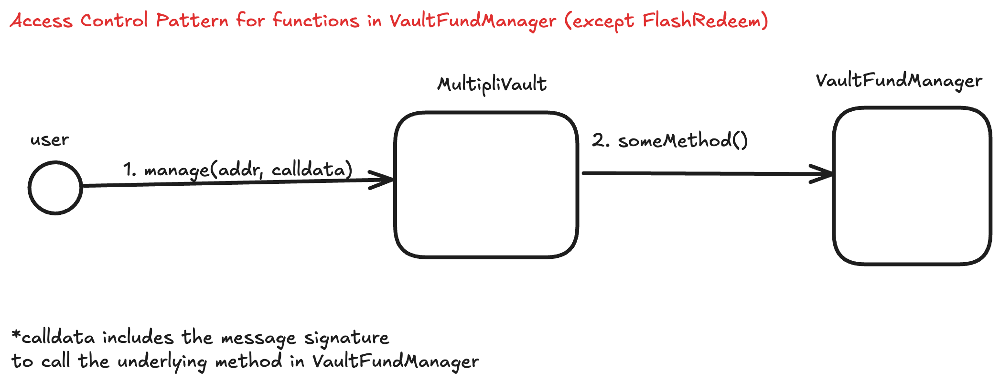
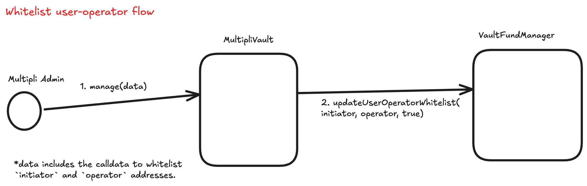
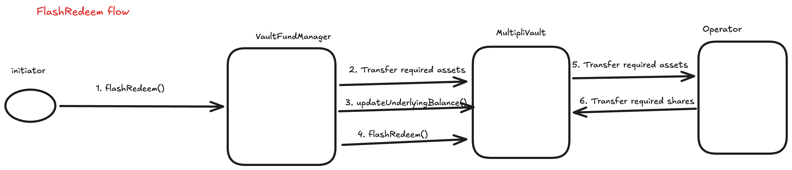
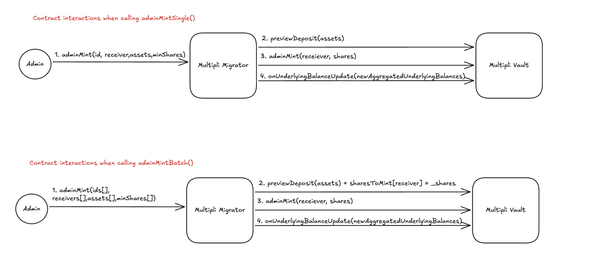
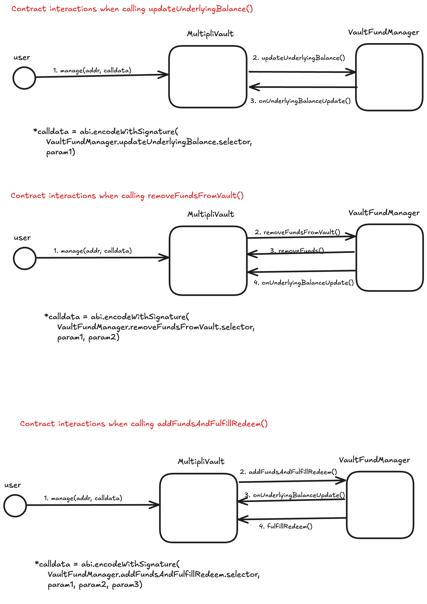

# Multipli Protocol - Documentation

Multipli is a Real World Asset (RWA) yield protocol that employs delta neutral strategies to generate consistent yield. Delta neutral strategies maintain a balanced position where the portfolio's value remains relatively stable regardless of market price movements, allowing the protocol to capture yield from various sources while minimizing directional risk.

This repository contains the smart contract implementation for the Multipli Protocol, providing ERC-4626 compatible vault interfaces that integrate seamlessly with the broader DeFi ecosystem. The protocol is deployed using the [UUPS proxy pattern](https://docs.openzeppelin.com/contracts/4.x/api/proxy), which enables secure upgradability while maintaining a single contract address.

> **Note:** This repository is a **stripped-down, deployment-focused subset** of the full Multipli Protocol codebase. Active development, experimentation, and internal tooling occur in a separate internal repository; only the contracts and components required for deployment, verification, and external review are included here.
>
> This branch contains the **V2 version** of the Multipli Protocol contracts. To review the **V1 version**, please refer to the [`v1` branch](https://github.com/multipli-libs/Barebones-MultipliVault/tree/v1). To determine whether a deployed contract uses V1 or V2, refer to the [Deployed Contracts](#4-deployed-contracts) section.

## 1. Repository Structure

This repository contains the core smart contracts and deployment scripts for the Multipli Protocol.

### 1.1 Versions

- **V1 (v1 branch)**: Initial implementation featuring xUSDC vault on Avalanche C-Chain and Monad - [View V1 Documentation](https://github.com/multipli-libs/Barebones-MultipliVault/tree/v1)
- **V2 (current branch)**: Enhanced version with multi-chain support and additional features.

## 2. Local Setup

1. **Clone the repository**

```bash
   git clone <repository-url>
   cd <repository-name>
```

2. **Install Forge dependencies**

```bash
   forge install
```

3. **Install Node.js dependencies**

```bash
   # Ensure you're using Node.js version 20 or higher
   node -v # Should show v20.x.x or higher
   npm install
```

4. **Create deployment wallets**

```bash
   # Create wallets for different environments
    cast wallet import <your_avalanche_mainnet_wallet> --interactive   # Avalanche mainnet deployment
    cast wallet import <your_avalanche_testnet_wallet> --interactive   # Avalanche testnet deployment

```

5. **Configure environment variables**

```bash
   # Create .env file with RPC URLs and API keys
   cp .env.example .env
   # Edit .env with your configuration
```

### 2.1 Build and Test

```bash
# Build contracts
forge build

# Run tests with detailed output (For xUSDC on Avalanche Mainnet by default)
forge clean && forge build && forge test -vvvv

#Run test for a particular config
forge clean && forge build && \
NETWORK=[network] TOKEN=[token] ENV=[testnet|mainnet] forge test

#Run tests for every config
npm run test

# Generate gas snapshots
forge snapshot
```

#### 1.3.1 Test Combinations

```bash
COMBINATIONS=(
"mainnet ethereum usdc"
"testnet ethereum usdc"
"mainnet ethereum wbtc"
"testnet ethereum wbtc"
"mainnet bsc usdc"
"testnet bsc usdc"
"mainnet bsc wbtc"
"testnet bsc wbtc"
"mainnet avalanche usdc"
"testnet avalanche usdc"
"testnet avalanche btc.b"
"mainnet avalanche btc.b"
)
```

#### 1.3.2 Folders to run the combinations

```bash
COMBO_FOLDERS=(
  "test/unit/vault/*"
  "test/unit/managers/*"
  "test/unit/migrator/*"
  "test/unit/fees/*"
)
```

#### 1.3.3 Folder to run the test once

```bash
NON_CONFIG_FOLDERS=(

  "test/unit/deployment/*"
)
```

### 2.2 Help

```bash
forge --help
anvil --help
cast --help
```

## 3. Deployment

The repository includes deployment scripts for different networks in the `script/deployment/` directory:

- **Mainnet deployments**: `script/deployment/Deploy[vault][network]Mainnet.s.sol`
- **Testnet deployments**: `script/deployment/Deploy[vault][network]Testnet.s.sol`
- **Local deployments**: `script/deployment/Deploy[vault][network]Anvil.s.sol`

### 3.1 Understanding Deployment Scripts

The repository includes two types of deployment scripts:

1. **`Base.s.sol`** - For deploying the **first vault** on a network (deploys new `VariableVaultFee` contract)
2. **`BaseWithSharedConfig.s.sol`** - For deploying **additional vaults** on a network (reuses existing `VariableVaultFee` contract)

**Multipli's Deployment Pattern:**

- Multipli deployed **xUSDC first** (using `Base.s.sol`) on Avalanche
- Then deployed **xBTC.b second** (using `BaseWithSharedConfig.s.sol`) sharing xUSDC's fee contract
- This creates a single `VariableVaultFee` contract per network for all vaults

**Your Deployment Options:**

- Deploy **any vault first** using `Base.s.sol` (xUSDC, xBTC.b, or any other)
- Deploy **subsequent vaults** using `BaseWithSharedConfig.s.sol` with the first vault's fee contract address
- The provided scripts follow Multipli's deployment order (xUSDC → xBTC.b) but you can adapt them for your needs

### 3.2 Pre-Deployment Checklist

1. **Choose deployment type:**

   - First vault on network? Use `Base.s.sol` scripts
   - Additional vault on network? Use `BaseWithSharedConfig.s.sol` scripts and have the existing `VariableVaultFee` address ready

2. **Configure deployment parameters** in the relevant deployment script:

   - Update `OWNER` to your deployer address
   - Update `MULTIPLI_FUND_MANAGER_WALLET` to your fund manager address
   - Verify `ASSET`, `SHARE_NAME`, `SHARE_SYMBOL` are correct
   - Confirm `INITIAL_LOCK_DEPOSIT_AMOUNT` and `MIN_DEPOSIT_AMOUNT` and `VARIABLE_VAULT_FEE` (For subsequent vault deployments)

3. **Ensure wallet has sufficient funds:**

   - Native tokens for gas fees
   - Underlying asset tokens for initial deposit

4. **Set up RPC endpoints** in foundry.toml or .env file

### 3.3 Deployment Commands

> **Note:** The examples below follow Multipli's deployment pattern (xUSDC first using `Base.s.sol`, then xBTC.b using `BaseWithSharedConfig.s.sol`). You can deploy any vault first - just use the appropriate script type.

#### 3.3.1 Avalanche Mainnet - xUSDC (First Vault)

```bash
forge script script/deployment/DeployXUSDCAvalancheMainnet.s.sol:DeployXUSDCAvalancheMainnet \
  --rpc-url avax_mainnet \
  --account <your_avalanche_mainnet_wallet> \
  --sender <your_deployer_address> \
  --verify \
  --broadcast \
  -vvvv
```

#### 3.3.2 Avalanche Mainnet - xBTC.b (Additional Vault)

```bash
# Shares VariableVaultFee with xUSDC
forge script script/deployment/DeployXBTCBAvalancheMainnet.s.sol:DeployXBTCBAvalancheMainnet \
  --rpc-url avax_mainnet \
  --account <your_avalanche_mainnet_wallet> \
  --sender <your_deployer_address> \
  --verify \
  --broadcast \
  -vvvv
```

#### 3.3.3 Avalanche Testnet - xUSDC (First Vault)

```bash
forge script script/deployment/DeployXUSDCAvalancheTestnet.s.sol:DeployXUSDCAvalancheTestnet \
  --rpc-url avax_testnet \
  --account <your_avalanche_testnet_wallet> \
  --sender <your_deployer_address> \
  --verify \
  --broadcast \
  -vvvv
```

#### 3.3.4 Avalanche Testnet - xBTC.b (Additional Vault)

```bash
# Shares VariableVaultFee with xUSDC
forge script script/deployment/DeployXBTCBAvalancheTestnet.s.sol:DeployXBTCBAvalancheTestnet \
  --rpc-url avax_testnet \
  --account <your_avalanche_testnet_wallet> \
  --sender <your_deployer_address> \
  --verify \
  --broadcast \
  -vvvv
```

#### 3.3.4 Local Deployment (Anvil)

```bash
# Start Anvil in a separate terminal first
anvil

# Deploy first vault (xUSDC)
forge script script/deployment/anvil/DeployXUSDCAnvil.s.sol:DeployXUSDCAnvil \
  --rpc-url localhost \
  --account <your_local_deployer_wallet> \
  --sender <your_deployer_address> \
  --broadcast \
  -vvvv

# Deploy additional vault (xBTC.b) - shares fee contract with xUSDC
forge script script/deployment/anvil/DeployXBTCBAnvil.s.sol:DeployXBTCBAnvil \
  --rpc-url localhost \
  --account <your_local_deployer_wallet> \
  --sender <your_deployer_address> \
  --broadcast \
  -vvvv
```

### 3.4 Post-Deployment Verification

After deployment, verify that:

1. All contracts are deployed and verified on the block explorer
2. Initial deposit was successful
3. Roles and permissions are correctly configured
4. Fee structures are properly set
5. If deploying additional vault: Confirm fee contract is correctly shared with first vault

### 3.5 Manual Contract Verification

If the `--verify` flag doesn't verify all contracts (particularly implementation contracts), use manual verification:

```bash
forge verify-contract \
  --chain-id <chain_id> \
  <implementation_address> \
  src/vault/MultipliVault.sol:MultipliVault \
  --compiler-version v0.8.30+commit.2fe13dce \
  --verifier-url '<explorer_api_url>' \
  --etherscan-api-key <your_api_key> \
  --watch
```

**Example for Avalanche Mainnet (Snowtrace via RouteScan):**

```bash
forge verify-contract \
  --chain-id 43114 \
  0x2a66bb2da3ad1c854e79307f64b862decd860d4c \
  src/vault/MultipliVault.sol:MultipliVault \
  --compiler-version v0.8.30+commit.2fe13dce \
  --verifier-url 'https://api.routescan.io/v2/network/mainnet/evm/43114/etherscan' \
  --etherscan-api-key <your_api_key> \
  --watch
```

## 4. Deployed Contracts

### 4.1 Deployed Contracts (V2)

**Source Code:**  
[V2 branch](https://github.com/multipli-libs/Barebones-MultipliVault/tree/v2)

---

#### Avalanche C-Chain (Mainnet)

The following V2 contracts are deployed on Avalanche C-Chain:

| Contract                      | Address                                                                                                                 | Description                                               |
| ----------------------------- | ----------------------------------------------------------------------------------------------------------------------- | --------------------------------------------------------- |
| **MultipliVault (xUSDC)**     | [`0xCF0Eb4ac018C06a16ED5c63484823C7805e7599D`](https://snowtrace.io/address/0xCF0Eb4ac018C06a16ED5c63484823C7805e7599D) | Core vault contract for xUSDC deposits                    |
| **VaultFundManager (xUSDC)**  | [`0x01e676EAA0C9780A88395c651349Cf08Fe52368e`](https://snowtrace.io/address/0x01e676EAA0C9780A88395c651349Cf08Fe52368e) | Manages fund movements and balance updates for xUSDC      |
| **RolesAuthority (xUSDC)**    | [`0xf580B985e2Fd8A8b0e4a56C2a7E24bC28e872609`](https://snowtrace.io/address/0xf580B985e2Fd8A8b0e4a56C2a7E24bC28e872609) | Role-based access control system for xUSDC                |
| **MultipliVault (xBTC.b)**    | [`0x468BbabAEf852C134b584382C0fef83F2954Cd5c`](https://snowtrace.io/address/0x468BbabAEf852C134b584382C0fef83F2954Cd5c) | Core vault contract for xBTC.b deposits                   |
| **VaultFundManager (xBTC.b)** | [`0x62c2181618833b202e68b5addc4279542978Ef47`](https://snowtrace.io/address/0x62c2181618833b202e68b5addc4279542978Ef47) | Manages fund movements and balance updates for xBTC.b     |
| **RolesAuthority (xBTC.b)**   | [`0x2393D41EBc41270431Bdbdd3B3Ed03879636Ee42`](https://snowtrace.io/address/0x2393D41EBc41270431Bdbdd3B3Ed03879636Ee42) | Role-based access control system for xBTC.b               |
| **VariableVaultFee (Shared)** | [`0x4E5FEa916ef8458b8D877BD760B6930Fb4f28B72`](https://snowtrace.io/address/0x4E5FEa916ef8458b8D877BD760B6930Fb4f28B72) | Handles fee calculations for both xUSDC and xBTC.b vaults |

> **Note:** xBTC.B shares the `VariableVaultFee` contract with xUSDC for consistent fee management across vaults.

---

### 4.2 Deployed Contracts (V1)

📌 **Source Code:**  
[V1 branch](https://github.com/multipli-libs/Barebones-MultipliVault/tree/v1)

---

#### Monad (Mainnet)

The following contracts are deployed on Monad:

| Contract                     | Address                                                                                                                  | Description                                 |
| ---------------------------- | ------------------------------------------------------------------------------------------------------------------------ | ------------------------------------------- |
| **MultipliVault (xUSDC)**    | [`0xd74FB32112b1eF5b4C428Fead8dA8d85A0019009`](https://monadscan.com/address/0xd74FB32112b1eF5b4C428Fead8dA8d85A0019009) | Core vault contract for USDC deposits       |
| **VaultFundManager (xUSDC)** | [`0xE1824bF952bB2E8414d12de8A9fc2cBc666D6758`](https://monadscan.com/address/0xE1824bF952bB2E8414d12de8A9fc2cBc666D6758) | Manages fund movements and balance updates  |
| **VariableVaultFee (xUSDC)** | [`0xA39986F96B80d04e8d7AeAaF47175F47C23FD0f4`](https://monadscan.com/address/0xA39986F96B80d04e8d7AeAaF47175F47C23FD0f4) | Handles fee calculations and configurations |
| **RolesAuthority (xUSDC)**   | [`0x2A66Bb2dA3AD1c854E79307F64b862DECD860D4c`](https://monadscan.com/address/0x2A66Bb2dA3AD1c854E79307F64b862DECD860D4c) | Role-based access control system            |

---

## 5. Contract Overview

### 5.1 Core Contracts

1. **MultipliVault.sol**  
   This is the primary contract where users, fund managers, and oracles interact with the protocol. It serves as the main entry point and inherits functionality from multiple base contracts:

   - `ERC4626Upgradeable` - Provides standardized vault interface
   - `AuthUpgradeable` - Handles role-based access control
   - `PausableUpgradeable` - Emergency pause functionality
   - `VaultFeeUpgradeable` - Fee calculation and management
   - `FundMovementHelperUpgradeable` - Assists with fund transfers

2. **VaultFundManager.sol**  
   Manages all fund movements and balance updates within the protocol. This contract handles the actual movement of assets and invokes `onUnderlyingBalanceUpdate` in `MultipliVault`. Access control is enforced through the established Auth system in `MultipliVault`.

   To interact with this contract:

   - Use the `manage` method in MultipliVault to call methods in `VaultFundManager`
   - Methods in `VaultFundManager` then call back to MultipliVault as needed

   `VaultFundManager` also prevents sandwich attacks by ensuring that fund movements and balance updates happen atomically. This prevents attackers from exploiting temporary fluctuations in `totalAssets()` and `totalSupply()` to manipulate share prices and extract value during deposits or redemptions.

   

3. **VariableVaultFee.sol**  
   Contains all fee calculation logic and is deployed as a separate contract from MultipliVault. This separation allows for flexible fee structures and independent upgrades. MultipliVault calls methods in this contract to calculate fees for various operations.

4. **RolesAuthority.sol**  
   Role-based access control system adapted from [Solmate](https://github.com/transmissions11/solmate/blob/main/src/auth/authorities/RolesAuthority.sol). This contract manages permissions for different user roles within the protocol.

5. **MultipliMigrator.sol** _(V2 Feature - Not currently in use)_  
   Enables secure and atomic migration of user balances from the v1 (non-ERC-4626) vault system to the v2 (ERC-4626-compliant) vault architecture. **This contract is currently not deployed on any network (mainnet or testnet) and is not being used in production.** The implementation is available for reference and future migration needs. See [Section 7.4](#74-multiplimigrator-vault-migration-layer) for detailed documentation.

### 5.2 Deployment Scripts

The deployment scripts are located in `script/deployment/` and organized by type:

**Two Deployment Patterns:**

1. **Base.s.sol** - Deploys a new vault with its own `VariableVaultFee` contract

   - Use for the **first vault** on any network
   - Deploys: RolesAuthority, VariableVaultFee, MultipliVault, VaultFundManager

2. **BaseWithSharedConfig.s.sol** - Deploys a new vault using an existing `VariableVaultFee` contract
   - Use for **additional vaults** on a network
   - Deploys: RolesAuthority, MultipliVault, VaultFundManager
   - Reuses: Existing VariableVaultFee from first vault

**Multipli's Deployment Example:**

- Avalanche: xUSDC (using Base.s.sol) → xBTC.b (using BaseWithSharedConfig.s.sol)
- Result: Single VariableVaultFee contract managing fees for both vaults

## 6. User Roles

Roles are defined in [Role.sol](./src/common/Role.sol)

1. **FUND_MANAGER_ROLE**  
   Addresses with this role can invoke vault operations through the `VaultFundManager` contract using the `manage` method in `MultipliVault`. With the necessary permissions, they can also directly call the `updateUnderlyingBalance` method in `MultipliVault` to report changes in underlying asset positions. These addresses can perform the following operations:

   - `removeFundsFromVault`: Transfers assets from the vault to external strategies or exchanges
   - `updateUnderlyingBalance`: Updates the vault's view of assets held in external strategies
   - `addFundsAndFulfillRedeem`: Adds liquidity to the vault and processes pending redemption requests

2. **FUND_MANAGER_CONTRACT_ROLE**  
   The deployed `VaultFundManager` contract addresses are assigned this role. Addresses with this role can invoke critical vault operations including:

   - `onUnderlyingBalanceUpdate` - Updates the vault's view of underlying assets
   - `removeFunds` - Withdraws assets from the vault
   - `fulfillRedeem` - Processes pending redemption requests
   - `flashRedeem` - Flash redemption for unwinding leveraged positions (deprecated - see [Section 7.3](#73-flashredeem-deprecated))

3. **ADMIN_ROLE**  
   Administrative permissions for managing the protocol configuration and user permissions.

4. **ETHEREUM_MIGRATOR_V1** _(V2 Feature - Not currently in use)_  
   Reserved role for the [`MultipliMigrator`](#74-multiplimigrator-vault-migration-layer) contract. When deployed, addresses with this role can invoke critical vault operations including:

   - `onUnderlyingBalanceUpdate` - Updates the vault's view of underlying assets
   - `adminMint` - Allows admin to mint shares to a specified receiver

   > **Note:** This role is defined in the codebase but is not currently assigned to any deployed contract.

# 7. Usage

## 7.1 Deposit Flow

Users can deposit assets using two standard ERC-4626 methods:

1. **`deposit(assets, receiver)`** - Deposit a specific amount of USDC to receive xUSDC shares
2. **`mint(shares, receiver)`** - Specify the amount of xUSDC shares you want to receive

Before depositing, we recommend using the preview methods to understand the transaction outcome:

**`previewDeposit(assets)`** - Input the amount of USDC you want to deposit. Returns the number of xUSDC shares you'll receive after fees are deducted. Note that front-running is possible, so the actual amount received may differ slightly.

**`previewMint(shares)`** - Input the number of xUSDC shares you want to receive. Returns the amount of USDC required after accounting for fees.

## 7.2 Withdrawal / Redemption Flow

Unlike standard ERC-4626 vaults, Multipli uses an asynchronous redemption system to accommodate the underlying investment strategies. Direct `redeem` and `withdraw` methods are not supported and will revert if called.

**Redemption Process:**

1. **Request Redemption** - Call `requestRedeem(shares)` to initiate a redemption request. This locks your shares for redemption.

2. **Processing Period** - Redemptions take 4-10 days to process. This timeframe allows the fund managers to unwind positions in the underlying strategies without negatively impacting returns.

3. **Fulfillment** - Fund managers call `fulfillRedeem` through the `VaultFundManager` contract to disburse USDC to user wallets.

**Preview Redemption** - Use `previewRedeem(shares)` to calculate the amount of USDC you'll receive for your xUSDC shares after fees.

## 7.3 FlashRedeem (Deprecated)

> ** DEPRECATION NOTICE**  
> **Current Status:** FlashRedeem is **deprecated** and **will not be used** going forward. All permissions have been revoked and the feature is no longer accessible in production even though the method exists on the contract. This functionality will be removed in v3 version.

### 7.3.1 What is FlashRedeem?

FlashRedeem is an advanced feature that allows authorized users to instantly convert their vault shares (like xUSDC) back to underlying assets (like USDC) within a single blockchain transaction. This is particularly useful for users who have their vault shares locked in external protocols (like lending platforms) and need to quickly unwind their positions.

Think of it as a "flash loan in reverse" - instead of borrowing assets and paying them back, you receive assets upfront and pay them back with equivalent shares.

### 7.3.2 Why was FlashRedeem used?

**Traditional Problem**: If you have 1,000 xUSDC shares but 800 of them are locked as collateral on a lending platform, you can't easily redeem them because you don't have all the shares in your wallet.

**FlashRedeem Solution**: The vault gives you USDC upfront, you use it to unlock your shares from the lending platform, then immediately return those shares to complete the redemption.

### 7.3.3 How to Use FlashRedeem

**Check Redemption Value**: Use `previewFlashRedeem(shares)` to see how much USDC you'll receive for your xUSDC shares after fees.

### 7.3.4 Key Players

- **Initiator**: The user who owns the shares and wants to redeem them
- **Operator Contract**: A smart contract that handles the complex unwinding logic (deployed by the initiator)
- **Multipli Admin**: The vault administrator who manages permissions and liquidity

### 7.3.5 Step-by-Step Process

#### Phase 1: Setup (One-time process)

1. **Request Access**: Initiator contacts the Multipli team to request FlashRedeem access
2. **Liquidity Provision**: Multipli team adds sufficient USDC to the VaultFundManager contract
3. **Authorization**: Multipli Admin whitelists the initiator and their operator contract using the vault's management system

#### Phase 2: Execution (Per redemption)

4. **Initiate FlashRedeem**: Initiator calls `VaultFundManager.flashRedeem()`
5. **Asset Transfer**: VaultFundManager transfers USDC to MultipliVault, then to the operator contract
6. **Position Unwinding**: Operator contract automatically:
   - Receives USDC from the vault
   - Uses USDC to repay debts and unlock collateral from external protocols
   - Collects the freed xUSDC shares
   - Returns the required amount of xUSDC shares back to the vault
7. **Completion**: System validates that the correct amount of shares were returned and the vault state is consistent

### 7.3.6 Technical Requirements

Your operator contract must implement the `IMultipliVaultCallee` interface, specifically the `onRedemptionFlashLoan()` method. This method is automatically called during the FlashRedeem process and must handle:

- Receiving the USDC from the vault
- Unwinding positions on external protocols
- Collecting and returning the equivalent xUSDC shares
- Ensuring all operations complete within the same transaction

### 7.3.7 Security Features

- **Whitelist Protection**: Only pre-approved initiator-operator combinations can use FlashRedeem
- **Atomic Execution**: Everything happens in one transaction - if any step fails, the entire operation reverts
- **State Validation**: Multiple checks ensure the vault remains in a consistent state after the operation
- **Fee Protection**: Appropriate fees are collected to prevent system abuse

### 7.3.8 Visual Flow



_Figure 1: The one-time setup process for authorizing users and operator contracts_



_Figure 2: Complete FlashRedeem execution flow showing all contract interactions_

### 7.3.9 Use Cases

- **Leveraged Position Unwinding**: Close complex leveraged positions across multiple protocols
- **Liquidity Management**: Quickly free up locked collateral without manual intervention
- **Arbitrage Opportunities**: Take advantage of price discrepancies across platforms
- **Emergency Exits**: Rapidly exit positions during market volatility

### 7.3.10 Example Implementation

```solidity
// Example operator contract implementing IMultipliVaultCallee
contract PositionUnwinder is IMultipliVaultCallee {
    function onRedemptionFlashLoan(
        address vault,
        address asset,
        address owner,
        address receiver,
        uint256 sharesToReturn,
        uint256 assetsReceived,
        bytes calldata data
    ) external override {
        // 1. Use received USDC to repay debts on lending protocol
        // 2. Withdraw xUSDC collateral from lending protocol
        // 3. Transfer required xUSDC shares back to vault
        // 4. Keep any excess for the user
    }
}
```

## 7.4 MultipliMigrator: Vault Migration Layer

> **Important:** The MultipliMigrator contract is **not currently deployed on any network** (mainnet or testnet) and is **not being used in production**. The implementation exists in the codebase as a reference for future migration needs but has no active deployments or usage at this time.

### 7.4.1 Overview

The `MultipliMigrator` contract enables **secure and atomic migration of user balances** from the **v1 (non-ERC-4626)** vault system to the current **v2 (ERC-4626-compliant)** vault architecture.  
It acts as a **dedicated operational migration layer**, ensuring that legacy users are seamlessly transitioned into the new vault system while maintaining correct accounting and share ratios.

While the `MultipliVault` contract can technically perform `adminMint()` operations directly, **all user migrations must be executed through `MultipliMigrator`** to ensure state consistency, access control, and verifiable migration tracking.

---

### 7.4.2 How xToken Was Maintained in Multipli v1

The v1 (non-ERC4626) system used [StarkEx](https://starkware.co/starkex/) as the L2 layer to manage user assets. A unique Stark key was generated for each user, which was used to sign the transfers during the buy (stake) and sell (unstake) of xTokens. The yield rate was updated on a daily basis and stored along with yield generated by each user in the backend database which was then used to calculate and distribute the yield when the user claimed the yield accrued on their staked xTokens. The yield was distributed on weekly basis, so if a user claimed yield, they would be receiving that yield on the distribution cycle end date.

### 7.4.3 Why Use MultipliMigrator?

#### 1. Secure & Controlled Migration

The migrator enforces an **allowlist-based authorization model**, meaning only approved operator addresses can initiate migrations.  
This prevents unauthorized minting and ensures that only validated legacy balances are migrated.

#### 2. Atomic State Updates

All migration actions (minting shares + updating vault balances) happen atomically within a single transaction.  
This ensures that **the vault's `aggregatedUnderlyingBalances()` always matches total migrated assets**, preventing accounting drift or partial updates.

#### 3. Verifiable Migration Tracking

Each migration is uniquely identified by an **`id`**, stored in the `migrationID` mapping.  
Once an ID is marked as migrated, it cannot be reused — ensuring strong replay protection and immutable auditability.

---

### 7.4.4 Core MultipliMigrator Activities

#### 1. Single User Migration (`adminMintSingle()`)

- **Purpose**: Migrate an individual user's legacy vault balance into the ERC-4626 vault
- **Key Features**:
  - Validates user and asset inputs
  - Computes share equivalence using `previewDeposit()`
  - Mints new shares via `vault.adminMint()`
  - Updates total aggregated vault balance
  - Marks migration ID as completed
- **Use Case**: Used for migrating single user balances or manual migrations for specific users.

#### 2. Batch Migration (`adminMintBatch()`)

- **Purpose**: Efficiently migrate multiple users in a single transaction
- **Key Features**:
  - Supports up to `MAX_BATCH_SIZE` users per batch
  - Computes all share values before executing mints
  - Prevents partial migrations via atomic execution
  - Updates the aggregated vault balance once at the end of the batch
- **Use Case**: Bulk migration of legacy user balances during vault transition.

---

### 7.4.5 Access Pattern

#### Recommended Flow

```
Authorized Operator → MultipliMigrator.method() → MultipliVault (adminMint + balance update)
```

### 7.4.6 How It Works

1. **Authorization**

   - The caller must be allow-listed (`allowList[user] = true`).
   - The migrator contract itself holds the required vault role (`ETHEREUM_MIGRATOR_V1`).

2. **Execution**

   - The migrator calculates share equivalence via `vault.previewDeposit()`.
   - It then mints new shares for the user using `vault.adminMint()`.

3. **State Synchronization**

   - After minting, the vault's `onUnderlyingBalanceUpdate()` is called to synchronize the total underlying asset balance.

4. **Validation & Replay Protection**
   - Each migration ID is permanently recorded in `migrationID`.
   - Any duplicate or reused ID triggers an immediate revert.

---

### 7.4.7 Security Benefits

- **Access-Controlled Operations** — Only allow-listed operators can perform migrations
- **Replay Protection** — Unique migration IDs prevent repeated minting
- **Atomic Execution** — Minting and balance updates occur in one transaction
- **State Validation** — Vault invariants remain consistent after each migration
- **Batch Safety** — Enforces a `MAX_BATCH_SIZE` limit to prevent excessive gas or partial failures

---

### 7.4.8 Integration Examples

#### Migrating a Single User

```solidity
// Migrate legacy user with ID = 42, holding 10,000 USDC
migrator.adminMintSingle(
    42,                 // migration ID
    0xUserAddress,      // receiver
    10_000e6,           // assets (USDC)
    9_999e6             // min expected shares
);
```

#### Migrating Multiple Users

```solidity
uint256[] memory ids = [1, 2, 3];
address[] memory users = [user1, user2, user3];
uint256[] memory assets = [10000e6, 5000e6, 7500e6];
uint256[] memory minShares = [9999e6, 4999e6, 7499e6];

migrator.adminMintBatch(ids, users, assets, minShares);
```

---

### 7.4.9 Visual Flow


_Figure: Detailed example flows showing how different operations are executed through MultipliMigrator_

---

### 7.4.10 Best Practices

- Always use `MultipliMigrator` to handle user migrations — never call `adminMint()` directly.
- Use **unique migration IDs** for every user.
- Keep batch sizes within the defined `MAX_BATCH_SIZE` (default = 10).
- Verify share calculations using `previewDeposit()` before performing migrations.
- Restrict allow-list access to **trusted migration operators** only.

---

### 7.4.11 Security Considerations

- **Authorization Required** — All operations require allow-list verification.
- **Immutable Records** — Each migration ID can only be used once.
- **State Invariants** — The migrator enforces underlying balance consistency.
- **Atomic Updates** — Minting and balance updates revert together if any check fails.
- **Isolated Scope** — No dependency on external protocols, minimizing attack surface.

---

## 7.5 VaultFundManager: Operational Management Layer

### 7.5.1 Overview

The `VaultFundManager` serves as a dedicated operational layer that handles all critical vault maintenance activities. While `MultipliVault` technically has the capability to perform these operations directly, **all vault operations should be routed through `VaultFundManager`** to ensure proper state management and security.

### 7.5.2 Why Use VaultFundManager?

#### Atomic Operations & MEV Protection

`VaultFundManager` prevents sandwich attacks and MEV exploitation by ensuring that fund movements and balance updates happen atomically. This critical protection prevents attackers from:

- Exploiting temporary fluctuations in `totalAssets()` and `totalSupply()`
- Manipulating share prices during state transitions
- Extracting value through front-running deposits or redemptions

#### Consistent State Management

The fund manager ensures that all vault state changes maintain proper invariants and happen in the correct sequence, preventing inconsistencies that could arise from direct vault interactions.

### 7.5.3 Core VaultFundManager Activities

#### 1. Fund Removal (`removeFundsFromVault()`)

- **Purpose**: Transfer assets from vault to external strategies or exchanges
- **Key Feature**: Maintains `totalAssets()` invariant by updating aggregated underlying balances
- **Use Case**: Moving funds to trading strategies while preserving share price

#### 2. Balance Updates (`updateUnderlyingBalance()`)

- **Purpose**: Sync vault's understanding of assets held in external strategies
- **Key Feature**: Updates aggregated balances to reflect yield generation and strategy performance
- **Use Case**: Regular synchronization with external protocol positions

#### 3. Redemption Fulfillment (`addFundsAndFulfillRedeem()`)

- **Purpose**: Complete pending redemption requests by adding liquidity and processing withdrawals
- **Key Feature**: Three-step atomic process prevents price manipulation
- **Use Case**: Settling user withdrawal requests after bringing funds back from strategies

### 7.5.4 Access Pattern

#### Recommended Flow

```
User/Operator → MultipliVault.manage() → VaultFundManager.method() → MultipliVault (callback)
```

#### How It Works

1. **Authorization**: Use `MultipliVault.manage()` method to call `VaultFundManager` functions
2. **Execution**: `VaultFundManager` performs the requested operation
3. **Callback**: `VaultFundManager` calls back to `MultipliVault` as needed to update state
4. **Validation**: Built-in checks ensure state consistency throughout the process

#### Security Benefits

- **Single Entry Point**: All operations go through vault's authorization system
- **Atomic Execution**: Complex multi-step operations happen in single transaction
- **State Validation**: Automatic verification of vault invariants
- **MEV Protection**: Prevents exploitation of temporary state inconsistencies

### 7.5.5 Integration Examples

#### Moving Funds to Exchange

```solidity
// Move 100,000 USDC to external exchange
vault.manage(
    address(fundManager),
    abi.encodeWithSelector(
        VaultFundManager.removeFundsFromVault.selector,
        exchangeAddress,
        100000e6
    ),
    0
);
```

#### Updating Strategy Yields

```solidity
// Update vault with new strategy balances (including yield)
vault.manage(
    address(fundManager),
    abi.encodeWithSelector(
        VaultFundManager.updateUnderlyingBalance.selector,
        newTotalBalance
    ),
    0
);
```

#### Fulfilling User Redemptions

```solidity
// Fulfill pending redemption after bringing funds back
vault.manage(
    address(fundManager),
    abi.encodeWithSelector(
        VaultFundManager.addFundsAndFulfillRedeem.selector,
        userAddress,
        sharesAmount,
        assetsAmount
    ),
    0
);
```

### 7.5.6 Visual Flow


_Figure 1: Recommended access pattern showing secure operation flow through vault's manage function_


_Figure 2: Detailed example flows showing how different operations are executed through VaultFundManager_

### 7.5.7 Best Practices

- **Always use `MultipliVault.manage()`** to call VaultFundManager methods
- **Never call VaultFundManager methods directly** from external contracts

### 7.5.8 Security Considerations

- **Authorization Required**: All operations require proper vault-level permissions
- **State Invariants**: Fund manager enforces critical vault invariants during operations
- **Atomic Execution**: Operations either complete fully or revert entirely
- **MEV Protection**: Built-in safeguards against value extraction attacks

---

**Important**: While `MultipliVault` can technically perform these operations directly, using `VaultFundManager` is **strongly recommended** for security, consistency, and MEV protection.

## 8. Known Issues

1. ### Yield Distribution Exploit

   Attackers can exploit Yield distribution through `onUnderlyingBalanceUpdate` Sandwiching

   **Scenario:** When operators call `onUnderlyingBalanceUpdate` to report the yield generated, attackers can front-run this transaction with a large deposit transaction, capturing a disproportionate share of the yield update and then immediately withdraw their position.

   **Solution Implemented:** Instead of updating the underlying balance all at once, the onUnderlyingBalanceUpdate function is triggered every 8 hours over a 7-day period, totaling 21 updates per week. This staggered approach distributes yield updates more evenly and helps prevent potential exploitation by malicious users

2. ### Fee Inconsistency in Redemptions

   There's a potential inconsistency between `requestRedeem` and `fulfillRedeem` operations due to fee changes:

   **Scenario:** A user initiates a redeem request when the fee is 100 USDC. Before the redemption is fulfilled, the fee configuration is updated.

   - **If fee increases:** User receives less than initially previewed
   - **If fee decreases:** User receives more than initially previewed

   **Mitigation:** Fund managers can invoke `cancelRedeem` when there's a significant fee mismatch, allowing users to reinitiate their redemption request with current fee rates.

3. ### Asset/Share Mismatch in fulfillRedeem

   When fund managers call `fulfillRedeem`, there's a possibility of specifying incorrect asset amounts for the corresponding shares.

   **Example:** User requests redemption of 100 shares worth 100 USDC. During fulfillment, admin might incorrectly specify 100 shares with only 50 USDC or vice versa.

   **Impact:** These mismatched assets/shares will remain in `_pendingRedeem` state. The backend system should implement validation to prevent such discrepancies.

4. ### Temporary Share Price Impact During Pending Redemptions

   **Issue**:  
   Asynchronous redemption processing can cause temporary share price flunctuations when underlying balances are updated between `requestRedeem` and `fulfillRedeem` calls.

   **Root Cause:**  
    When users call `requestRedeem()`, shares are transferred to the vault but `totalSupply` and `totalAssets` remain unchanged until `fulfillRedeem()` is executed. If `updateUnderlyingBalance()` occurs during this pending period, it affects the share price calculation for all remaining shareholders.

   **Scenario 1: Underlying Assets Increase**

   ```
   Initial State:
      - totalSupply: 1,000 shares
      - totalAssets: 1,000 USDC
      - Price: 1 USDC per share

      1. User requests redemption of 100 shares (100 USDC value)
      2. updateUnderlyingBalance() increases totalAssets 1,100 USDC
         - New price: 1.1 USDC per share
      3. fulfillRedeem() executed:
         - User receives: 100 USDC (original redemption value)
         - 100 shares burned
         - Final state: 900 shares, 1,000 USDC
         - **Result: Price increases to 1.111 USDC per share**

   ```

   **Scenario 2: Underlying Assets Decrease**

   ```
   Initial State:
      - totalSupply: 1,000 shares
      - totalAssets: 1,000 USDC
      - Price: 1 USDC per share

      1. User requests redemption of 100 shares (100 USDC value)
      2. updateUnderlyingBalance() decreases totalAssets to 900 USDC
         - New price: 0.9 USDC per share
      3. fulfillRedeem() executed:
         - User receives: 100 USDC (original redemption value)
         - 100 shares burned
         - Final state: 900 shares, 800 USDC
         - **Result: Price decreases to 0.889 USDC per share**
   ```

   **Impact**:

   - Severity: Low - No funds are lost, only timing of profit/loss recognition
   - Effect: Remaining shareholders experience delayed reflection of actual vault performance
   - Duration: Temporary until all pending redemptions are fulfilled

   **Potential Solutions:**

   - Exclude pending shares from price calculations: effectiveSupply = totalSupply - pendingShares
   - Trade-off: Could cause price volatility if redemptions are cancelled

   **Current Status**:

   Accepted as design limitation - vault performance is eventually accurate once redemptions are processed and increase in price can be attributed an additional yield.

## 9. Backend Monitoring and Operations

The backend system performs critical monitoring and maintenance tasks:

1. **Event Monitoring:** All events from the following contracts are tracked:

   - MultipliVault
   - VariableVaultFee
   - RolesAuthority
   - VaultFundManager

2. **Sweep Funds:** When vault's USDC balance crosses a certain threshold (e.g., 10,000 USDC), fund manager invokes `VaultFundManager.removeFundsFromVault` method to move the funds to exchanges/strategies.

3. **Balance Updates:** Periodically calls `onUnderlyingBalanceUpdate` with the latest asset values from underlying strategies.

4. **Redemption Processing:** Tracks `requestRedeem` requests to ensure funds are disbursed within the 4-10 day window.

5. **Fee Change Management:** Monitors fee changes between `requestRedeem` and `fulfillRedeem`, canceling requests when significant mismatches occur.

6. **Safety Mechanisms:** If the percentage difference exceeds `maxPercentageChange` in `onUnderlyingBalanceUpdate`, the contract is automatically paused and alerts are triggered. Monitor for `Paused` events.

7. **Fee Contract Management:** The fee contract can be set to `address(0)` if needed. The system emits `FeeContractUpdated` events whenever the fee contract is modified in MultipliVault.

## 10. Version 1

For the initial implementation with single vault deployment on a network, please refer to the [V1 branch](https://github.com/multipli-libs/Barebones-MultipliVault/tree/v1).
